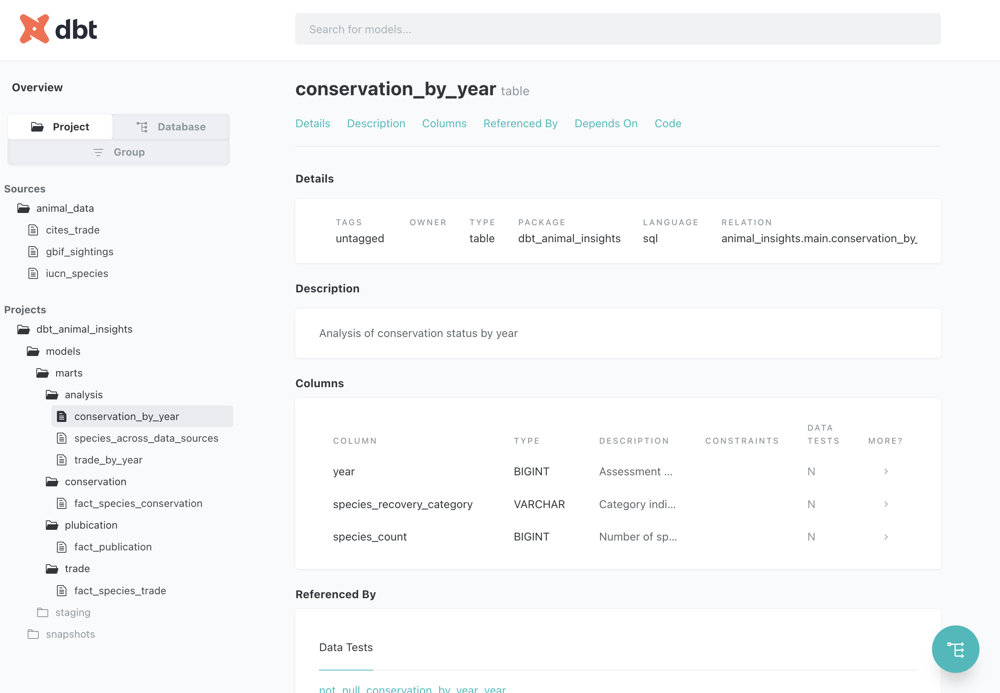
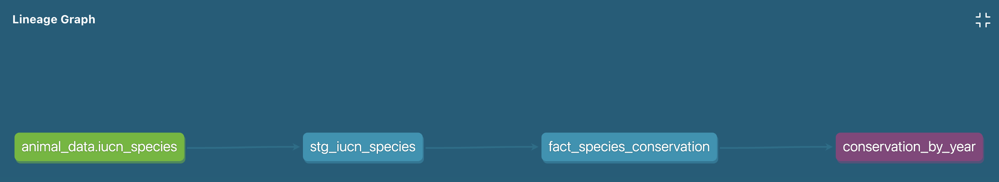

# DBT Animal Insights

A data transformation project that analyzes conservation status, trade patterns, and publication data for animal species using `dbt` and `DuckDB`.

This project transforms raw data from multiple sources:
- IUCN species conservation status data
- CITES international trade records
- GBIF biodiversity publications

The transformed data provides insights into species conservation trends, trade patterns, and research publication activity over time.

## Project Structure

- `models/`: Contains all data transformation logic
  - `staging/`: Initial data cleaning and standardization
    - `stg_iucn_species.sql`: Standardizes IUCN conservation data
    - `stg_cites_trade.sql`: Standardizes CITES trade records
    - `stg_gbif_sightings.sql`: Standardizes GBIF publication data
  - `marts/`: Business-level transformations
    - `analysis/`: Cross-domain analytical models
      - `conservation_by_year.sql`: Conservation status trends by year
      - `species_across_data_sources.sql`: Species appearing in multiple datasets
      - `trade_by_year.sql`: Trade volume analysis by year
    - `conservation/`: Conservation-specific models
      - `fact_species_conservation.sql`: Fact table for species conservation data
    - `trade/`: Trade-specific models
      - `fact_species_trade.sql`: Fact table for species trade data
    - `publication/`: Publication-specific models
      - `fact_publication.sql`: Fact table for publication data
- `snapshots/`: Tracks changes in data over time
  - `iucn_species_snapshot.sql`: Tracks changes in species conservation status
- `analyses/`: Ad-hoc analytical queries
- `macros/`: Reusable SQL snippets
- `seeds/`: Static data files

## Generic Testing Strategy

### Prerequisites
- dbt (version 1.9.0 or later)
- DuckDB (for local development)

### Installation
- Clone this repository
- Install dependencies: pip install dbt-core dbt-duckdb
- Set up your `profiles.yml` file with your DuckDB credentials | For local development, duckdb made it easy to access without required an authentication (For production grade, see more )

- Run `dbt deps` to install any package dependencies

### Running the project
- Run models: `dbt run --target duckdb`
- Generate documentation: `dbt docs generate` && `dbt docs serve`

## Generic Testing Strategy

This project uses dbt's built-in testing functionality to ensure data quality. Tests are defined in `models/schema.yml` files alongside the models they test.

Key test types implemented:
- Uniqueness constraints on primary keys
- Not-null constraints on required fields
- Referential integrity between related models
- Custom tests for specific business rules

Run tests with: `dbt test`

## Project Documentation
The project includes comprehensive documentation generated by dbt. Below is a sample view of the documentation showing the `conservation_by_year` model:

- The dbt documentation provides detailed information about:

    

    -  Model structures and relationships

    - Column definitions and data types

    

    - Data lineage showing upstream and downstream dependencies

    - Source definitions and configurations

### Key Insights
This project enables analysis of:

- Conservation status trends over time (as shown in the conservation_by_year model)

- Correlation between trade activity and conservation status

- Publication frequency related to endangered species

- Species that appear across multiple datasets
